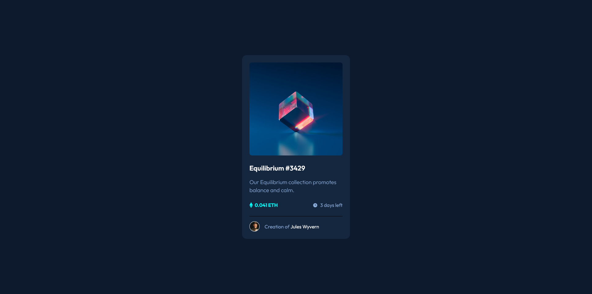

# Frontend Mentor - NFT preview card component solution

This is a solution to the [NFT preview card component challenge on Frontend Mentor](https://www.frontendmentor.io/challenges/nft-preview-card-component-SbdUL_w0U). Frontend Mentor challenges help you improve your coding skills by building realistic projects. 

## Table of contents

- [Overview](#overview)
  - [The challenge](#the-challenge)
  - [Screenshot](#screenshot)
  - [Links](#links)
- [My process](#my-process)
  - [Built with](#built-with)
  - [What I learned](#what-i-learned)
  - [Continued development](#continued-development)
  - [Useful resources](#useful-resources)
- [Author](#author)
- [Acknowledgments](#acknowledgments)

**Note: Delete this note and update the table of contents based on what sections you keep.**

## Overview

### The challenge

Users should be able to:

- View the optimal layout depending on their device's screen size
- See hover states for interactive elements

### Screenshot

### Links

- Solution URL: [https://github.com/asad102/nft_preview_card](https://github.com/asad102/nft_preview_card)
- Live Site URL: [https://asad102.github.io/nft_preview_card/]https://asad102.github.io/nft_preview_card/)

## My process

### Built with

- Semantic HTML5 markup
- CSS custom properties
- Flexbox
- CSS Grid
- Mobile-first workflow
-  [Tailwindcss](https://tailwindcss.com/) - CSS Framework

### Continued development
CSS & JS

## Author

- Website - [Abdirahim Ali](https://www.abdirahimali.com)
- Frontend Mentor - [@asad102](https://www.frontendmentor.io/profile/asad102)
- Twitter - [@abdirahimali](https://x.com/abdirahimali)

## Acknowledgments
Thanks Frontend Mentor For The Challenges
